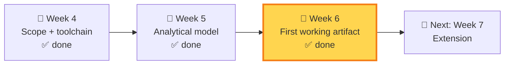
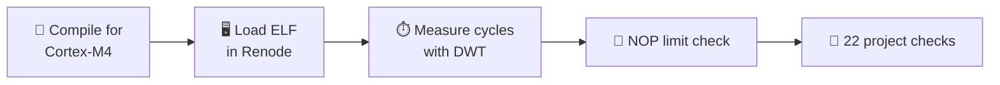

# 🔐 VESPER-SEC-01: Cryptographic Benchmarking Under Emulation

**Author:** Rutvika Mahadev Ashtekar
**Programme:** VISVAMBHARA Weeks 4–12
**Domain:** 🛡️ Cybersecurity (Option A)
**Project:** 🐝 Nano-Bee Secure Communications
**Status:** ✅ Week 4 complete · ✅ Week 5 complete · ✅ Week 6 complete

---

## 🎯 What's This Project About?

The Nano-Bee project focuses on secure communication for a resource-constrained swarm-robot platform.

This project asks:

> **Which cryptographic primitives can be benchmarked on a Cortex-M4 under emulation, and what are their measured cycle, stack, and code-size costs?**

I'm benchmarking **4 cryptographic primitives**:

 | Primitive                    | Type                              | Purpose                    |
| ---------------------------- | --------------------------------- | -------------------------- |
| 🔐 **Ascon v1.2**            | Lightweight authenticated encryption | Benchmark target        |
| 🔐 **ChaCha20-Poly1305**     | Authenticated encryption           | Benchmark target            |
| 🔐 **Kyber-512**              | Post-quantum KEM                  | Benchmark target            |
| 🔐 **SPHINCS+-Haraka-128f**   | Post-quantum signatures           | Benchmark target            |

**Tool:** Renode (Cortex-M4 emulation environment)
**Measurement:** Cycle counts, stack measurement where valid, and compiled ELF/code size.

---

## 🗺️ Weeks 4–6 at a glance



### 🧱 Week 4
* ✅ Scope selected: crypto benchmarking under emulation
* ✅ Cortex-M4 / STM32F4 target environment established
* ✅ Arm GNU Toolchain, QEMU and Renode environment prepared during Week 4
* ✅ NOP analytical sanity check: **1,000 NOPs → 1,003 cycles (0.3% difference)**

### 📐 Week 5
* ✅ Analytical model and governing equations prepared
* ✅ Cycle measurement method defined
* ✅ Cycles/byte calculation defined
* ✅ Energy model defined
* ✅ Resource/feasibility criteria defined
* ✅ Analytical limiting case identified
* ✅ Crypto execution deliberately deferred to Week 6 (no benchmark numbers in Week 5)

### 🚀 Week 6
* ✅ Four primitives compiled and executed in Renode
* ✅ Cycle results recorded
* ✅ Valid stack results recorded where possible
* ✅ ELF sizes recorded
* ✅ 22/22 project checks passing
* ✅ 12 evidence screenshots collected
* ✅ SPHINCS+ stack limitation documented
* ✅ Heinz reference mismatch documented
* ✅ Week 6 Deliverable and Progress Report completed

---

## 📊 Quick Facts

| 📌 Detail          | 📌 Value                                           |
| ------------------ | -------------------------------------------------- |
| 🎯 Target          | ARM Cortex-M4 (STM32F407-class); 168 MHz configured for the emulation model |
| 🖥️ Emulator       | Renode, STM32F4 Discovery platform model           |
| ⏱️ Cycle counter  | DWT peripheral at `0xE0001000`                     |
| 🔧 Build tools     | Arm GNU Toolchain; MSYS2 supporting build environment |
| 📚 References      | Documented in the project reports                  |
| 💻 Where it ran    | Locally in Renode; no physical hardware used for these measurements |

---

## 📁 Repository Structure (High-Level)

```
week6/
├── 📂 Evidence/                          ← 12 evidence screenshots
├── 📂 src/
│   ├── 📂 ascon/                         ← Ascon v1.2
│   │   └── 📂 ascon-ref/
│   ├── 📂 chacha/                        ← ChaCha20-Poly1305
│   │   ├── 📂 chacha-download/
│   │   └── 📂 chacha20-poly1305-ref/
│   ├── 📂 heinz-mkm4/                    ← Heinz reference (investigated only)
│   ├── 📂 kyber-ref/                     ← Kyber-512
│   └── 📂 sphincsplus/                   ← SPHINCS+-Haraka-128f
│       ├── 📂 benchmark/
│       ├── 📂 params/
│       └── 📂 test/
└── 📄 VESPER-SEC-01-Week6-Deliverable.docx
```

> 🔎 This is a high-level view. Each folder also contains further source files, which are not listed here.

---

# 🚀 Week 6: First Working Artifact

The charter says Week 6 must deliver **"a minimum version that produces a number, verified against at least one analytical limit."**



### 🛠️ Tools used

| 🧰 Tool | 🎯 Used for |
|---|---|
| Arm GNU Toolchain | Cortex-M4 compilation |
| Renode | Cortex-M4 emulation and DWT cycle measurement |
| MSYS2 | Supporting build environment |

DWT peripheral mapped at `0xE0001000` with a configured frequency of 168 MHz; `DWT→CYCCNT` is reset and enabled before each benchmark run.

---

### 📊 Results

#### 🟦 Ascon v1.2

| Metric | Value |
|---|---|
| ⏱️ Measured cycles | **9,606** (16-byte plaintext) |
| 📈 Cycles/byte | **600.375** (9,606 / 16) |
| 🧠 Reported stack | 264 B |
| 📦 ELF size (text / data / bss / total) | 22,984 / 0 / 44 / **23,028 B** |

#### 🟩 ChaCha20-Poly1305

| Metric | Value |
|---|---|
| ⏱️ Measured cycles | **40,597** (114-byte plaintext) |
| 📈 Cycles/byte | **≈ 356.114** (40,597 / 114) |
| 🧠 Reported stack | 544 B |
| 📦 ELF size (text / data / bss / total) | 5,104 / 0 / 148 / **5,252 B** |
| ✅ Flags | `valid = 1`, `done = 1` |

#### 🟪 Kyber-512 (`KYBER_K = 2`)

For a fixed-size KEM operation, **cycles per operation** is the main metric (not cycles/byte).

| Operation | ⏱️ Measured cycles |
|---|---|
| 🔑 Key generation | **1,157,443** |
| 🔒 Encapsulation | **1,300,194** |
| 🔓 Decapsulation | **1,538,934** |

| Metric | Value |
|---|---|
| 🧠 Reported stack | 9,748 B |
| 📦 ELF size (text / data / bss / total) | 10,992 / 0 / 3,288 / **14,280 B** |
| ✅ Flags | `valid = 1`, `done = 1` |

#### 🟧 SPHINCS+-Haraka-128f

| Operation | ⏱️ Measured cycles |
|---|---|
| 🔑 Key generation | **153,849,855** |
| ✍️ Signing | **3,738,100,285** |
| ✔️ Verification | **242,116,523** |

| Metric | Value |
|---|---|
| 📝 Signature length | 17,088 B |
| 📦 ELF size (text / data / bss / total) | 11,592 / 4 / 17,292 / **28,888 B** |
| ✅ Flags | `valid = 1`, `done = 1` |
| 🧠 Peak stack | ❌ **Not reported** (see Limitations) |

#### 🏁 Side-by-side

| Primitive | ⏱️ Main cycle result | 📦 ELF total | 🧠 Stack |
|---|---|---|---|
| Ascon v1.2 | 9,606 (16 B) | 23,028 B | 264 B |
| ChaCha20-Poly1305 | 40,597 (114 B) | 5,252 B | 544 B |
| Kyber-512 | KeyGen 1,157,443 | 14,280 B | 9,748 B |
| SPHINCS+-Haraka-128f | KeyGen 153,849,855 | 28,888 B | Not reported* |

> ⚠️ Ascon (16 B) and ChaCha20 (114 B) used different input sizes, so compare their **cycles/byte**, not raw cycles.
>
> \* SPHINCS+ peak-stack measurement was invalid and is excluded from quantitative stack comparison. The SPHINCS+ cycle and ELF-size results are valid.
---

### 📏 Analytical sanity check (NOP test)

| 📐 Expected | 📏 Measured | 📉 Difference |
|---|---|---|
| 1,000 cycles (1,000 NOPs) | **1,003 cycles** | **0.3%** (within the ≤ 5% tolerance) |

✅ **NOP analytical sanity check: PASS.** It verifies the basic instruction/cycle-counting path, but does not validate cycle accuracy for cryptographic implementations.

---

### 🧪 Week 6 test suite

🧪 **Week 6 project test suite: 22 / 22 checks passing.**

| Area | Result |
|---|---|
| NOP analytical limit | ✅ PASS |
| Ascon v1.2 checks | ✅ PASS |
| ChaCha20-Poly1305 checks | ✅ PASS |
| Kyber-512 checks | ✅ PASS |
| SPHINCS+-Haraka-128f checks | ✅ PASS |

📝 These are **not** "22 cryptographic tests". They cover the NOP limit plus result-validity and logic checks on the recorded benchmark outputs. They are not a cycle-accuracy validation or a published-result reproduction.

---

### 📸 Evidence (`Evidence/`, 3 screenshots per primitive)

| Primitive | Files |
|---|---|
| 🟦 Ascon v1.2 | `01_ascon_final_compile_size.png` · `02_ascon_final_elf_symbols.png` · `03_ascon_final_renode_results.png` |
| 🟩 ChaCha20-Poly1305 | `01_chacha_final_compile_size.png` · `02_chacha_final_elf_symbols.png` · `03_chacha_final_renode_results.png` |
| 🟪 Kyber-512 | `01_kyber_final_compile_size.png` · `02_kyber_final_elf_symbols.png` · `03_kyber_final_renode_results.png` |
| 🟧 SPHINCS+ | `01_sphincs_final_compile_size.png` · `02_sphincs_final_elf_symbols.png` · `03_sphincs_final_renode_results.png` |

Each primitive has: **compile/ELF size** → **ELF symbols** → **Renode execution results**.

---

### ⚠️ Limitations

**🛑 SPHINCS+ peak stack is invalid.** The stack-pattern region had already been overwritten before the measurement scan, so the raw figure (57,856 B) represents the full scanned region rather than a valid peak-stack measurement. It is not reported as a valid peak-stack result and is excluded from quantitative stack comparison.

**🔬 Heinz reference:** The Heinz implementation was built successfully for investigation (after fixing missing `.type` / `.thumb_func` metadata in four Keccak assembly functions). It is first-order masked Kyber768, whereas the Week 6 benchmark uses unmasked Kyber-512. Therefore, no direct numerical comparison is made.

---

### 🧩 SPHINCS+ source attribution

The SPHINCS+ reference implementation comes from the official **sphincs/sphincsplus** repository and is **not** my original work. My integration changes, made to run it bare-metal on Cortex-M4 / Renode:

- 🎲 Deterministic `randombytes()` (`benchmark/randombytes.c`), replacing OS randomness
- 🧱 Local `memset` / `memcpy` / `memmove` / `memcmp` (`benchmark/mem.c`), since no host C runtime is present
- 🩹 Minor source compatibility / pointer-type fixes (including `merkle.c`)
- 🗺️ A project linker script `sphincs.ld` and Cortex-M4 startup code `startup.s`
- 🖥️ A dedicated Renode platform file `sphincs-stm32f4.repl`, adding the DWT mapping the default platform did not provide

---

### ▶️ How the benchmarks were run

1. 🔨 Compile the benchmark with the Arm GNU Toolchain to produce an `.elf`.
2. 🖥️ Launch Renode and create the STM32F4 Discovery machine (board file `platforms/boards/stm32f4_discovery-kit.repl`).
3. ⏱️ Configure the DWT peripheral at `0xE0001000` with a frequency of 168 MHz. SPHINCS+ uses the dedicated `sphincs-stm32f4.repl` platform file.
4. 📦 Load the benchmark ELF and start the emulation.
5. 📖 Read the result variables (cycles, `valid`, `done`).

---

### 📐 Analytical budget from the project model

The Week 5 model defined project resource assumptions for later feasibility analysis. Week 6 recorded benchmark measurements but did **not** calculate measured energy per operation or issue a final feasibility verdict.

These are **project assumptions**, not measured results or official Nano-Bee specifications:

* 18 MHz allocation for secure communication
* 50 KB RAM allocation
* ~14.1 mW derived power assumption

---

### 📊 What the Week 6 measurements cover

| Metric | Week 6 status |
|---|---|
| Cycles/byte | Ascon and ChaCha20 |
| Cycles/operation | Kyber-512 and SPHINCS+ |
| Stack | Ascon, ChaCha20, Kyber-512 (SPHINCS+ invalid) |
| ELF/code size | All four |
| Energy/op | **Not measured** |

---

### 🚫 What Week 6 does NOT claim

| ❌ Not claimed |
|---|
| Published-result reproduction (Heinz or any other) |
| Hardware-validated cycle accuracy |
| Crypto-specific cycle-accuracy validation |
| A final FEASIBLE / MARGINAL / NOT FEASIBLE verdict |
| Energy-per-operation numbers |
| A valid SPHINCS+ peak-stack measurement result |

---

## 📌 Notes for Group Members

| 📍 Question | 📍 Answer |
|---|---|
| Where's the Week 6 code? | `week6/src/` (one folder per primitive) |
| Where's the Week 6 report? | `week6/VESPER-SEC-01-Week6-Deliverable.docx` |
| Where's the evidence? | `week6/Evidence/` |
| Where did the Week 6 measurements come from? | Renode emulation |
| Is SPHINCS+ stack reported? | ❌ No. The peak-stack measurement was invalid and excluded |
| What's next? | Week 7 extension |

---

## 📞 Contact Info

| 📱 Contact       | 🔗 Link                                                            |
| ---------------- | ------------------------------------------------------------------ |
| 👤 **GitHub**    | [rutvikaashtekar1607](https://github.com/rutvikaashtekar1607)      |
| 💼 **LinkedIn**  | [Rutvika Ashtekar](https://www.linkedin.com/in/rutvikaashtekar07/) |
| 🏫 **Programme** | VISVAMBHARA (VESPER Cybersecurity)                                 |

---

**Last Updated:** 🗓️ Week 6
